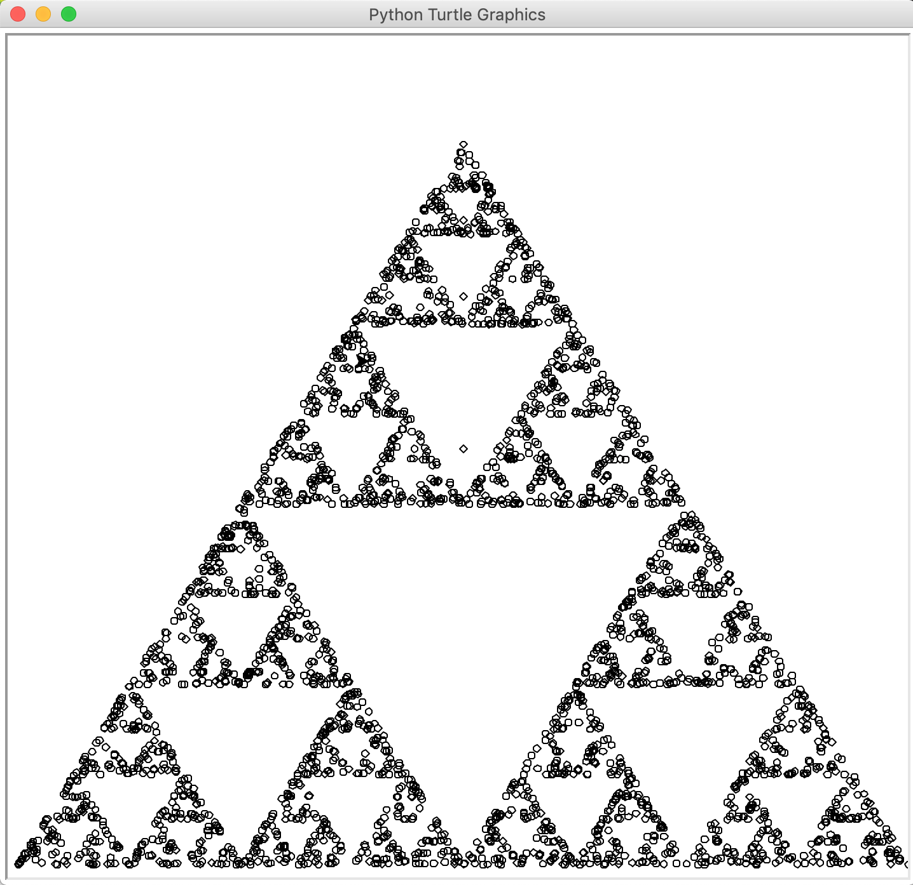

# Chaos Triangle
Chaos Triangle is a program that generates a Sierpinski triangle fractal as a result of chaos theory. It places a random point within a triangle and then continues to place random points. As each random point is placed, the figure begins to appear.

## Example
